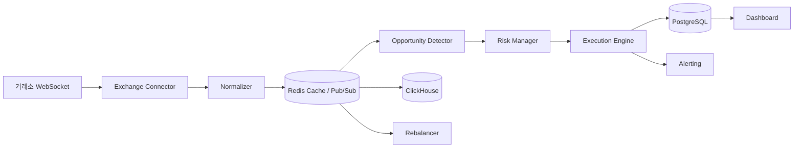

# 시스템 아키텍처

ArBot의 전체 시스템 구조와 핵심 모듈, 데이터 흐름을 설명합니다.

## 전체 시스템 구성도



## 핵심 모듈

### Exchange Connector

거래소와의 실시간 통신을 담당하는 모듈입니다.

- **역할**: WebSocket을 통한 실시간 오더북/체결 데이터 수신, REST API를 통한 주문 실행
- **구조**: 추상 인터페이스(`BaseConnector`)를 기반으로 거래소별 구현체 제공
- **핵심 기능**:
  - WebSocket 연결 관리 (자동 재연결, 하트비트)
  - 거래소별 Rate Limit 관리 (Weight, Count, Token Bucket 방식)
  - 데이터 정규화 (거래소별 상이한 형식을 통합 모델로 변환)

```
connectors/
├── base.py              # 추상 커넥터 인터페이스
├── websocket_manager.py # WebSocket 연결 관리
├── rate_limiter.py      # 거래소별 Rate Limit 관리
├── binance.py           # Binance 커넥터
├── okx.py               # OKX 커넥터
├── bybit.py             # Bybit 커넥터
├── upbit.py             # Upbit 커넥터
├── bithumb.py           # Bithumb 커넥터
├── kucoin.py            # KuCoin 커넥터
├── gate.py              # Gate.io 커넥터
└── bitget.py            # Bitget 커넥터
```

### Opportunity Detector

차익거래 기회를 탐지하는 핵심 분석 엔진입니다.

- **역할**: Redis에서 실시간 가격 데이터를 수신하여 차익거래 시그널 생성
- **전략별 탐지기**:
  - `SpatialDetector` - 거래소 간 가격차 탐지
  - `TriangularDetector` - 삼각 차익 경로 탐색
  - `StatisticalDetector` - 공적분 기반 통계적 차익 탐지
- **스프레드 계산기**: 수수료, 슬리피지를 반영한 순이익 스프레드 계산

### Risk Manager

모든 거래 시그널에 대해 리스크 검증을 수행합니다.

- **포지션 제한**: 코인별, 거래소별, 전체 최대 노출 한도 관리
- **손실 제한**: 일일 최대 손실, 최대 드로다운 모니터링
- **이상 감지**: Flash Crash 등 비정상 가격 변동 감지
- **서킷 브레이커**: 연속 손실 발생 시 거래 자동 정지

### Execution Engine

리스크 검증을 통과한 시그널을 실제/가상으로 실행합니다.

- **실행 모드**:
  - `BACKTEST` - 히스토리컬 데이터 기반 시뮬레이션
  - `PAPER` - 실시간 데이터 + 가상 체결
  - `LIVE` - 실시간 데이터 + 실제 거래소 주문
- **주문 관리**: 주문 상태 추적, 부분 체결 처리, 실패 복구
- **체결 시뮬레이터**: 오더북 깊이를 반영한 현실적 체결 시뮬레이션

### Backtest Engine

히스토리컬 데이터를 기반으로 전략의 수익성을 검증합니다.

- **데이터 로더**: ClickHouse에서 틱 데이터 로딩
- **시장 시뮬레이터**: 과거 오더북 재현
- **성과 지표**: Sharpe Ratio, Max Drawdown, Win Rate, PnL 곡선
- **워크-포워드 분석**: 과적합 방지를 위한 시간순 학습/검증 반복

### Rebalancer

거래소 간 자금 균형을 유지합니다.

- **잔고 모니터링**: 거래소별 자산 분포 실시간 추적
- **최적 경로 계산**: 전송 수수료와 속도를 고려한 최적 리밸런싱 경로
- **네트워크 선택**: 자산별 최적 전송 네트워크 자동 선택 (예: USDT는 TRC20, BTC는 Lightning)

## 데이터 흐름 상세

전체 데이터 파이프라인은 다음과 같은 순서로 동작합니다.

```
1. 데이터 수집
   거래소 WebSocket → Exchange Connector → Normalizer → Redis Cache
                                                         ├── ClickHouse (틱 데이터 영구 저장)
                                                         └── Pub/Sub (실시간 이벤트)

2. 기회 탐지
   Redis Pub/Sub → Opportunity Detector → ArbitrageSignal 생성
                                           └── Signal Queue

3. 리스크 검증
   Signal Queue → Risk Manager → 승인/거부 판정
                                  ├── 포지션 한도 체크
                                  ├── 일일 손실 한도 체크
                                  └── 이상 가격 체크

4. 주문 실행
   승인된 시그널 → Execution Engine → Paper/Live Executor
                                       └── 거래소 API (주문 전송)

5. 기록 및 모니터링
   체결 결과 → Trade Logger → PostgreSQL (거래 기록)
                               ├── Dashboard (실시간 시각화)
                               └── Alerting (Telegram 알림)
```

## 기술 스택

| 영역 | 기술 | 용도 |
|------|------|------|
| **코어 엔진** | Python 3.12+ | 트레이딩 로직, 비동기 I/O (asyncio) |
| **성능 크리티컬** | Rust (Phase 3) | WebSocket 파싱, 스프레드 계산, 주문 서명 |
| **대시보드** | TypeScript / Next.js | 실시간 차트, 모니터링 UI |
| **거래소 연동** | ccxt, websockets, aiohttp | 100+ 거래소 통합, WebSocket 클라이언트 |
| **데이터 처리** | numpy, pandas, polars | 수치 연산, 시계열 처리, 대용량 DataFrame |
| **통계 분석** | statsmodels, scipy | 공적분 검정, 통계 모델링 |
| **RDBMS** | PostgreSQL 16 | 거래 기록, 설정, 일일 성과 |
| **시계열 DB** | ClickHouse | 틱 데이터, 오더북 스냅샷, 스프레드 히스토리 |
| **캐시/메시지** | Redis 7 | 실시간 가격 캐시, Pub/Sub, Streams |
| **모니터링** | Prometheus + Grafana | 메트릭 수집, 대시보드 시각화 |
| **로그** | Loki | 로그 집계 및 검색 |
| **알림** | python-telegram-bot | Telegram 알림 발송 |
| **보안** | cryptography | API 키 AES-256 암호화 |
| **컨테이너** | Docker + Docker Compose | 로컬 개발/테스트 환경 |
| **클라우드** | AWS (Tokyo/Singapore) | Phase 3 프로덕션 배포 |

## 데이터베이스 설계 개요

ArBot은 데이터 특성에 따라 3종의 데이터베이스를 사용합니다.

### PostgreSQL - 트랜잭션 데이터

거래 기록, 설정, 메타데이터 등 정합성이 중요한 데이터를 저장합니다.

- **exchanges**: 거래소 설정 (Tier, 수수료, 활성 상태)
- **trades**: 거래 기록 (주문 상세, 체결 결과, 수수료)
- **arbitrage_signals**: 차익거래 시그널 (탐지/실행/누락 이력)
- **portfolio_snapshots**: 포트폴리오 스냅샷 (거래소별 자산 잔고)
- **daily_performance**: 일일 성과 (PnL, Sharpe Ratio, Drawdown)

### ClickHouse - 시계열 데이터

대용량 틱 데이터와 오더북 스냅샷을 고속으로 저장/조회합니다.

- **orderbook_snapshots**: 오더북 스냅샷 (TTL 90일)
- **tick_trades**: 체결 데이터 (TTL 180일)
- **spread_history**: 스프레드 사전 계산 데이터 (TTL 365일)

`MergeTree` 엔진과 `LowCardinality` 타입으로 저장 효율과 쿼리 성능을 최적화합니다.

### Redis - 실시간 캐시

실시간 가격 데이터 캐시와 모듈 간 이벤트 전달을 담당합니다.

- **가격 캐시**: 거래소별 최신 오더북, 최우선 호가 (매우 낮은 TTL)
- **Pub/Sub**: 가격 업데이트 이벤트를 Detector에 실시간 전달
- **Streams**: 내부 이벤트 큐 (가격 → 탐지 → 실행 파이프라인)
